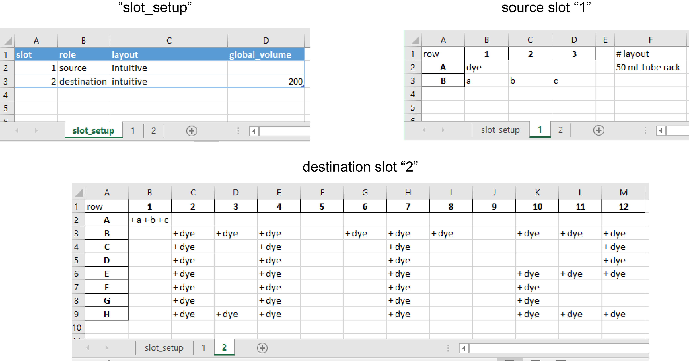
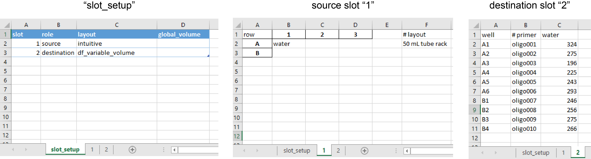
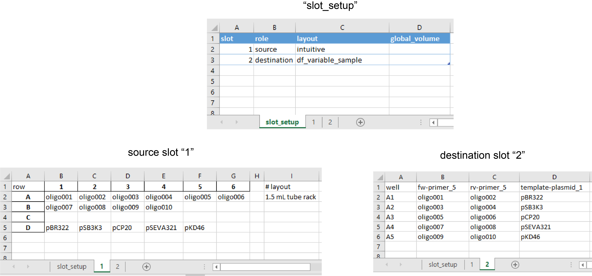
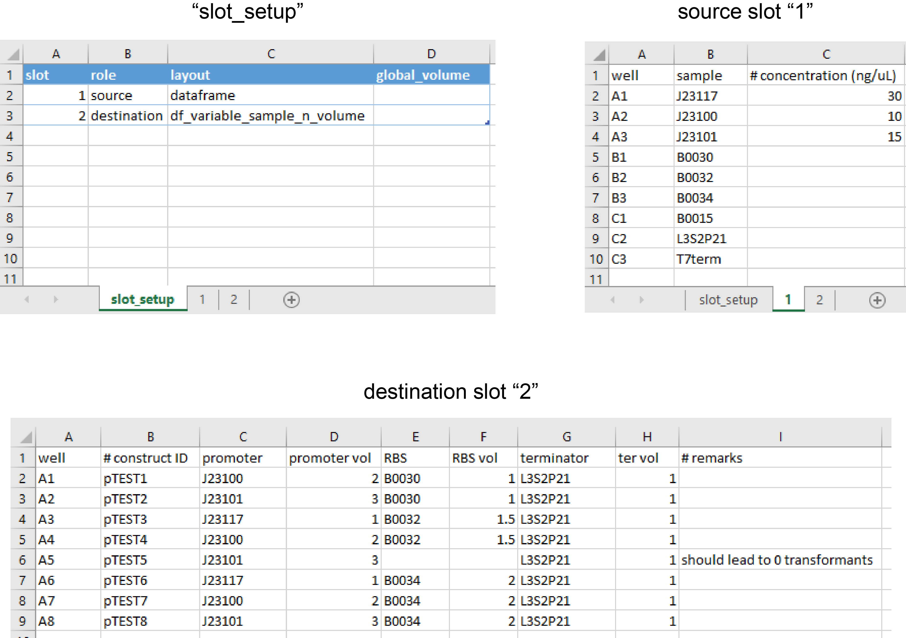

# OT-2 Protocols

This repository contains customizable OT-2 protocols written in [OT-2 APIv2](https://docs.opentrons.com). These protocols are (hopefully) user-friendly to those who need more customizations than what the [Opentrons Protocol Designer](https://designer.opentrons.com/) can offer. They are also written with modularity in mind, and should serve as boilerplate scripts for more experienced OT-2 users who just need to tweak existing protocols for **medium** throughput process.

## How these protocols work

For most protocols you find here, the basic idea here is that, the information of *what* to transfer and *how* to transfer are separated. Consider the case of resuspending lyophilized oligonucleotides with water (aka primer resuspension):  

* *what* = 20 tubes of primers, each tube receives a different volume water. (This changes every time)
* *how* = Transfer the water using the P300 single channel pipette. When dispensing, position the bottom of the tip 5 mm below the rim of the tube so that the same tip can be reused. (This never changes)

Therefore, every time we do primer resuspension we can reuse the protocol `primer_resuspension.py`. We only need to designate the *paths* and *volumes*, and also the *deck layout* and if necessary, the *pipette setup*, but we do not change the *behavior* of the pipetting steps.

### Working out transfer paths and volumes

When it comes to **paths** and **volumes**, say in the context of primer resuspension again, we think in terms of *what goes in what*:

1. "oligo001 resuspended with 324 µL of water",
2. "oligo002 resuspended with 275 µL of water", and etc.

But the API doesn't care about the actual identities of the samples. It only cares about *from where to where*:

1. "Transfer 324 µL from Slot 1, A1 (water) to Slot 2, A1 (primer tube)",
2. "Transfer 275 µL from Slot 1, A1 to Slot 2, A2"

The conversion from *what* to *where* is easy if you only have a few transfers, but it soon becomes mentally demanding as the number goes up. This is where the **InstructionWriter** comes into play. Instead of working out all the paths ourselves, we supply the InstructionWriter with an **intuitive Excel spreadsheet** stating what samples are in what wells, and where the liquids should go and the volumes. The InstructionWriter then process these information and write out parasable instructions, like:  

```python
"324$1_A1->2_A1", # = move 302 µL from slot 1 well A1 to slot 2 well A1
"275$1_A1->2_A2"
# ... and the list goes on
```
which you can copy and paste inside a list in the protocol file. The protocol will then execute these instructions with a tested and establisehd *behavior*.

This feature is indispensable when we need to deal with medium-throughput work, e.g. combinatorial Golden Gate Assembly. It can also be applied to high-throughput, though, at that point we probably have to change the paradigm and set up the experiment differently.

## Quick Example

We will exmplify with a hypothetical scenario of setting up combinatorial Golden Gate Assemblies.

1. Install Python or Anaconda (recommended) and `pip install opentrons`.
1. Clone / Download this repository onto your computer
2. Check the contents of an Excel file under the folder `/instructions_io/` that is named `example_GGA.xlsx`
3. Open an Anaconda terminal, navigate into the downloaded folder
4. Execute `>python -m InstructionWriter ./instructions_io/example_GGA.xlsx`
5. A file now appears under `/instructions_io/` that is called `example_GGA_instructions.txt`
6. Open this text file, copy all
7. Use a text editor (Spyder / Notepad), open `combinatorial_pipetting.py`
8. Paste the instructions under `inst_list = [` and before `]`

It should now look like:

```python
inst_list = [
'2$1_A2->2_A1',
'1.0$1_B1->2_A1',
'1$1_C2->2_A1',
'3$1_A3->2_A2',
'1.0$1_B1->2_A2',
'1$1_C2->2_A2',
'1$1_A1->2_A3',
'1.5$1_B2->2_A3',
#... many more lines here
]
```

9. Configure the deck layout and the pipette to be used as follow

```python
    slots_map = {
            '1':'opentrons_24_tuberack_eppendorf_1.5ml_safelock_snapcap',
            '2':'starlabpcrplateonws_96_wellplate_350ul'
            }

    # Configure tip racks and pipette

    r_pipette_name = 'p10_single'
    r_tiprack_slots = ['3']
    r_tiprack_name = 'geb_96_tiprack_10ul'
```

10. Make sure the right pipette (right mount) is used in the execution section

```python
for inst in inst_list:

    # Decodes information from each instruction line
    vol, path = inst.split('$')
    vol = float(vol)
    source, dest = path.split('->')
    source_slot, source_well = source.split('_')
    dest_slot, dest_well = dest.split('_')      

    # Execution of transfer
    r_pipette.transfer(vol,
                       labware_items[source_slot].wells_by_name()[source_well],
                       labware_items[dest_slot].wells_by_name()[dest_well],
                       new_tip='always'
                       )
```

SaveLog: simulate the protocol and check whether the steps are correct.
Then save the log file for troubleshooting.
This function directly builds upon the Opentrons `simulate` module

11. Open an Anaconda terminal in this dowloaded folder
12. Execute `>python -m SaveLog combinatorial_pipetting.py`
13. Open the folder `protocol_log` and open the text file named `combinatorial_pipetting_log.txt` to check the simulated protocol  

If your protocol employs any custom [labware definitions](https://support.opentrons.com/en/articles/3136504-creating-custom-labware-definitions), you need to put the custom labware definition files, in json formats, under the `./labware_def/` folder.

## The InstructionWriter and setting up the Excel files (short ver.)

The InstructionWriter takes an Excel file that adheres to certain formats, and does the job of converting human-readable instructions, e.g. "Transfer 5 µL of primer from tube primer001 to PCR tube", into machine-parsable, intermediate instructions with volume and path information, e.g. `5$1_A1->2_A1`. Users only need to specify the locations of source samples on one or more Excel spreadsheets, and what samples or liquids goes into destination wells in another Excel spreadsheets, and the InstructionWriter will perform the mapping. Then, these instructions can be directly copied and paste into a template protocol file, which will decode these intermediate instructions and feed them into the OT-2 APIv2 to execute the transfers.

The purpose of the InstructionWriter is offload the mentally demanding tasks of working out transfer paths for humans. It is **not** an OT-2 protocol writer.

The InstructionWriter also supports different layouts for destination formats.
Below a number of hypothetical cases are illustrated:

### intuitive
Example in patterning a plate in an human-trackable manner, and creating the characters "OT 2" on a 96-well plate:  
<br>


This is an example of defining transfers from an `intuitive` layout of Opentrons 4-in-1 50 mL tube rack to another `intuitive` layout of a 96-well plate, as such it was designated so under the `slot_setup` sheet. The destination sheet format supports receiving multiple liquids, i.e. samples "a" and "b" and "c", shown on slot 2 well A1. Each sample were prefixed with a `+` sign to tell the InstructionWriter to add each component to that well. For `intuitive` format, InstructionWriter does not support assigning different volumes to different transfers. Rather, a `global_volume` is given on the `slot_setup` sheet so every sample will receive 200 µL. That would of course means that slot 2 well A1 will receive 600 µL and will overflow. Volume handling is beyond the scope of the InstructionWriter.

### df_variable_volume
Example in primer resuspension:  
<br>

<br><br>

### df_variable_sample
Example in setting up multiple PCR reactions during cloning. Volumes of primers and templates are fixed at 5 µL and 1 µL, respectively, but the identity of primers and templates vary from one destination PCR tube to another:  
<br>

<br><br>

### df_variable_sample_n_volume
A most customizable table for combinatorial pipetting. The following example illustrates how it can be used for Gibson Assembly involving different constructs:
<br>

<br><br>

### Further instructions on using the InstructionWriter

- You can find templates for these layouts under `/instructions_io/_layout_templates.xlsx`
- For a complete guide of how to set up the Excel file, see [`Manual_on_InstructionWriter.pdf`](./Manual_on_InstructionWriter.pdf).
- The InstructionWriter can be called in a script using
```python
import InstructionWriter
instructions = InstructionWriter.write_instructions("your_excel_file.xlsx")
```

### Applications
Protocols I performed using the InstructionWriter:
- Mixing different plasmids for co-transformation (intuitive -> intuitive)
- Standardizing cell mass for whole-cell lysates preparation for Western Blot analysis (intuitive -> df_variable_sample_n_volume)
- Cherry picking strains that showed desirable traits when screening libraries of mutated variants (dataframe -> df_variable_sample)
- Moving PCR products from 96-well PCR plate into DNA purification columns (dataframe -> df_variable_sample)
- Migrating column purified DNA back to 96-well PCR for submission of Sanger sequencing (dataframe -> df_variable_sample)
- Moving bacterial cultures from 96-well deep plate into microcentrifuge tubes for saving glycerol stocks (intuitive -> intuitive)

### Feature and Advantage
1. The InstructionWriter allows comments to be inserted on the Excel spreadsheet so that users can write "metadata" regarding the source or desination samples. This is illustrated in the 3 examples above.
2. If there is an accident and you need to restart a protocol. It is easy to comment out the instructions that were done. If you use the many-to-many `pipette.transfer()` function from the API. You will need to comment out items on at least 2 separate lists.

### Limitations
1. The InstructionWriter mandates that each slot can only be either a "source" slot or a "destination" slot. It also does not accept a source sample to appear twice on the deck.
2. The characters `+`, `$` and `_` are forbidden characters for sample names.
3. The string "Unnamed:" is forbidden for column headers.
4. The characters `#` and `.` are discouraged for sample names.
5. The InstructionWriter does not know what the actual labware is, and will not figure out whether too much or too little volumes are in the source/destination wells.
6. The InstructionWriter will **not** work out how to add the samples most efficiently by doing one-aspirate-many-dispense actions. It was not designed to handle this problem. Users who wish to seed many wells on the plate with water should rely on programming through the API directly.
7. It takes a lot more time to compile for loops on instructions than to compile a  many-to-many `pipette.transfer()` on the OT-2's Raspberry Pi, resulting in longer time for the protocol to be loaded.

## Descriptions on Boilerplate Protocols
Protocols deposited are briefly described below. Please refer to the docstrings for detail descriptions.

| Protocol filename             | Requires InstructionWriter | Description                                                                                                                            |
|-------------------------------|----------------------------|----------------------------------------------------------------------------------------------------------------------------------------|
| combinatorial_pipetting.py    | Yes                        | Basic but versatile protocol that handles most complex pipetting needs                                                                 |
| combinatorial_pipetting_al.py | Yes                        | A variant protocol that handles pipetting samples with high alcohol contents                                                           |
| colony_plating.py             | No                         | Plate transformed bacterial onto rectangular one-well agar plate                                                                       |
| plate_induction_2con.py       | No                         | Dilute overnight grown bacterial cultures from a 96-well plate into 2 different 96-well plates, one with inducer and the other without |
| primer_rehydration.py         | Yes                        | Add water to lyophilized oligonucleotides                                                                                              |
| primer_dilution.py            | Yes                        | Dilute 100 µM of resuspended oligonucleotides from screw-cap tubes to 10 µM in snap-cap microcentrifuge tubes                          |

## Questions/Issues/Suggestions
Please contact me through email since I do not actively or passively monitor my GitHub. Thank you.

## License
Licensed under MIT license
